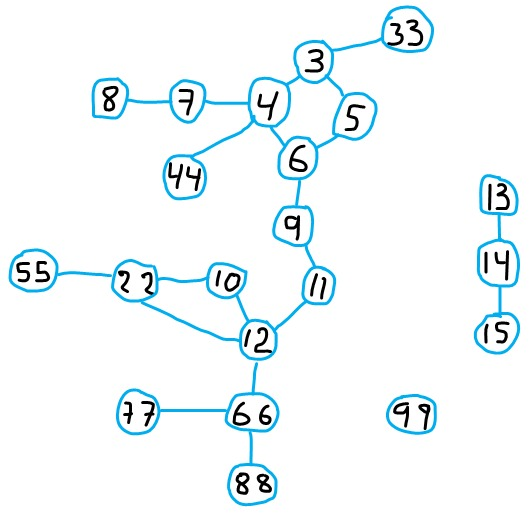

## Ejecución del programa
## Grafo

## Hash Repositorio

Diríjase al directorio grafo
~~~
$>> cd grafo
~~~
Digitar
~~~
$>> cmake -B "build" -S .
~~~ 
Se creará la carpeta bulid entre en build
~~~
$>> cd build
~~~
Compilar
~~~
$>> make
~~~
Los ejecutables 
~~~
$ master  repositorio  client  main
~~~

## Para esta prueba usaremos 1 cliente; 1 Master ; 3 Repositorios
~~~
            C
            |
            M
          / | \
        R0  R1  R2
          -    -    
~~~

1 Ejecute master->(gestiona al los clientes  y los repositorios)
~~~
$>> ./master
~~~

2 Ejecute un repositorio1 -> envíele la base de datos repo0.db
~~~
$>> ./repositorio repo0
~~~

2.1 Ejecute un repositorio2 -> envíele la base de datos repo1.db
~~~
$>> ./repositorio repo1
~~~

2.2 Ejecute un repositorio3 -> envíele la base de datos repo2.db
~~~
$>> ./repositorio repo2
~~~
Puede Crear cuantos repositorios requiera

Copie las bases de datos (repo0.db) (repo1.db) (repo2.db)
~~~
$>> copiar mydata.db que esta en source a la carpeta build
~~~
3 Ejecute un cliente
~~~
$>>./client
~~~
Puede crear varios clientes 
